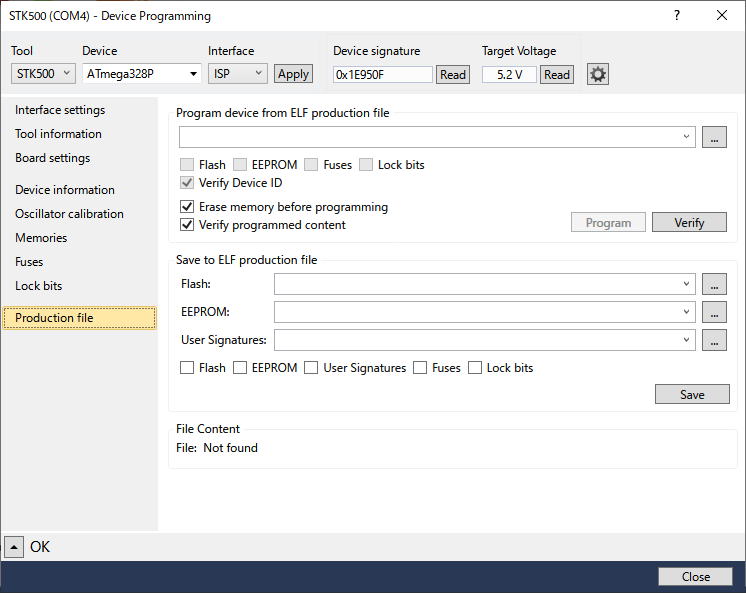

# ハードウェアの準備

[Atmel Studio 7.0で行うAVR開発][BackToToc]の一連の記事では、`MCU`として`ATmega328P-PU`(PDIP-28)を用います。理由は単純で、`Arduino Uno`等で広く使われているので、`MCU`の機能を理解する事が、他の`AVR`よりも早いと思われるからです。加えて価格も入手性も全く問題が無く、地方の方でも通販で簡単に入手する事が出来ます。価格が安いという事は、例え実験で破壊したとしても、あまりダメージを受けない、という事です。学習に失敗は付き物で失敗はする物、という気持ちで気楽に扱いたいと思います。

しかし、`Arduino`でもそうでしたが、実験で`Flash ROM`や`EEPROM`を頻繁に書き換えると、書き換え上限（`ATmega328P`では、データシートによると`Flash`が1万回、`EEPROM`が10万回）に達してしまった後の動作保証はありません。そこで、通常は出来る限り`IDE`の`Simulator`を用います。実際にハードウェアを使わないといけない状況になった場合（例：シリアル通信を行う）に初めて、物理的なハードウェアを利用します。従って、最初の章の方では`Simulator`だけで事足りる事が多く、後半に進むに従って`Simulator`と用意したハードウェアの両方を使う事になります。そういった理由で、最初からハードウェア全てを、無理に準備する必要はありません。

1. MCUボード
   
   MCUボードを用意する手段はいくつかあります。

   - 既存のMCUボード（orキット）を利用する
     
     `ATmega328P-PU`を用いたMCUボード（キット）は、探すと結構見つかります。`ISP`（`ICSP`とも言う。以下`ISP`で統一）の端子が付いていれば良いです。沢山あるので一例（私は使った事がありませんが）を挙げると、以下で買えると思います。

     秋月電子通商 -

     [ATmega168/328マイコンボードキット](http://akizukidenshi.com/catalog/g/gK-04590/)

   - `Arduino`（or互換機）を流用する
     
     `ATmega328P-PU`が搭載されている入手性の良い`Arduino`は、`Arduino Uno Rev.3`と、その互換機となります。`Arduino Uno Rev.3`には`ISP`端子があるので問題ありません。互換機では、`ISP`端子はあったりなかったりします。これらは例を挙げるまでもなく、普通に通販で買えると思います。
     
     **Caution: この選択肢を選んだ場合、`Arduino`が用いるブートローダーを破壊してしまう事になります。よって元に戻す（`Arduino`に）つもりがあるけれど、自分で戻す方法が判らないのであれば、この選択肢は諦めた方が良いと思います。**

     *Note: `Arduino Uno Rev.3`には、PCとのUSB-シリアル通信用に`ATmega16u2-MU`が搭載されていて、こちらにも`ISP`端子があります。間違えない様、注意が必要です。*

   - 自作する
     
     これが一番融通が利く上に、自身の経験値も上がる、良い組み合わせだと思います。私は、自作を選びました。但し、保護回路等が全く追加されていないので、ちょっとした不注意で簡単に壊れてしまいます。が、壊れたら直せば（交換等）良いのです。

     下の写真が、ユニバーサル基板に自作した実験用MCUボードです。5V/16MHzで動作します。実験ボードなので、クロック回路・リセット回路（`Arduino`として使う場合の書き込み用）・電源On表示用LED回路・パスコンがあるだけで、後は端子と配線だけです。

     

     `Arduino Uno Rev.3`と並べると、これぐらいの大きさです。

     

     *Note: 今になって考えると、水晶振動子をピンソケットに刺す形にすれば良かったと後悔しています。*

2. プログラマー
   
   `MCU`に対して、作成したプログラムやデータ等を書き込む装置です。`Atmel`純正の`AVR ISP mkII`は、秋葉や通販で気軽に買えるとは言えません。`Atmel`純正の`Atmel-ICE`を利用する場合、32bitの`AVR`を扱うならともかく、`ATmega328P-PU`を扱うには高価で機能がオーバースペックです。従って、何とか他のプログラマーを探す必要があります。これは、あまり選択肢がありません。

   - `AVR ISP mkII`互換機を用いる
     
     `IDE`とは、最も親和性が高い組み合わせだと思います。`Atmel`純正品は入手性に難がありますが、互換機は探せばいくつか見つかります。が、中国製が多く、マニュアルが読めない等の問題もあります。私は使った事がありませんが、以下で買えるみたいです。

     千石電商 -
     
     [Seeed Studio
Atmel AVRISP2.0 STK500 USB ISPプログラマー](https://www.sengoku.co.jp/mod/sgk_cart/detail.php?code=EEHD-4NXJ)

   - `IDE`と協調動作出来るプログラマーを用いる
     
     `Atmel`が発売したスターターキットに、`STK500`（廃番）がありました。この`STK500`と同様の書き込み手順を用いるプログラマーは、`IDE`と協調動作が出来ます。このタイプは、あまり多くはありませんが、探すと見つかります。私もこのタイプを使っています。以下で買えます。

     スイッチサイエンス -
     
     [Pololu USB AVRプログラマ v2.1](https://www.switch-science.com/catalog/3870/)

     [Pololu USB AVRプログラマ v2](https://www.switch-science.com/catalog/2662/) （廃番ですが、本記事で使っています）

     下の写真が、**Pololu USB AVR Programmer v2**です。意外と小さくて、びっくりしました。`ISP`用の端子に加えて、USB-シリアル変換用の端子も付いています。`Pololu`のHPは[こちら][PololuHP]。

     

3. USB-シリアル変換アダプター
   
   以後、**シリアル変換アダプター**と記述します。`Arduino`でデバッグするのに、シリアル通信モニタを利用した方は多いと思います。`IDE`を用いた開発も同様で、`MCU`と`ISP`だけだと、デバッグするのが困難な場合が殆どかと思います。なので、なるべく早い段階で`MCU`の`USART`（シリアル通信）機能を学習し、デバッグモニタとして使える様にしたいと思います。これは、その時から利用します。`Arduino`への書き込み用を持っている方は、それをそのまま利用して下さい。それ以外用でも、`USART`をカスタマイズすれば使えると思います。`Arduino`用は、探せばいくつも見つかりますが、動作電圧だけは注意して下さい。使用するMCUボードの電圧と合わせます。私が使っているタイプは、以下で買えます。

   スイッチサイエンス -

   [FTDI USBシリアル変換アダプター（5V/3.3V切り替え機能付き）](https://www.switch-science.com/catalog/1032/)

   下の写真が、私の使っているアダプターです。3.3V/5Vの両対応なので、省電力運用する`Arduino`を扱うのにもピッタリです。

   

ハードウェアが用意出来たら、次は`IDE`側でもハードウェアの準備をします。お使いのプログラマーに記載されている作業手順に従って、進めて下さい。

以下は、`IDE`側の準備を完了した後の`Available Tools`ウィンドウです。私の環境では、**STK500(COM4) Program only**と書かれている箇所が、プログラマーとなります。**Simulator**は、最初から表示されています。

このウィンドウが見当たらない場合は、以下の画像の様に、**Available Atmel Tools**メニューを選択すると表示されます。

シリアル変換アダプターは、`IDE`側では特に何も準備する必要はありません。

これで`IDE`とハードウェアの両方の準備が終わりましたので、双方を接続して簡単な接続テストをしてみましょう。

下は、私が自作したMCUボードを**Pololu USB AVR Programmer v2**と接続し、**スイッチサイエンス製シリアル変換アダプター**から給電した写真です。当たり前ですが、プログラマーとシリアル変換アダプターは、PCとも接続しています。

実はこのプログラマー、付属の設定ユーティリティーを使って、ターゲット(`MCU`)ボードへの電源供給を行う事が出来ます。が、自作したMCUボード側で、`ISP`端子・シリアル端子もしくはそれ以外のどの端子から給電するか？という選択機能がないので、自分でどこから給電するのか決めなくてはなりません。結論として、シリアル変換アダプターを接続しっぱなし（`USART`を使わなくても）にして、常にここから給電する事としました。

ハードウェアを全て接続し、通電を確認したら、`IDE`の`Available Tools`ウィンドウから、プログラマーを右クリックして表示されるメニューから、**Device Programming**を選択します。

すると、以下の様なDevice Programmingダイアログが表示されます。

このダイアログの**Tool**を、お使いのプログラマーに設定します。私の環境では、**STK500(COM4)** となります。**Device**は`ATmega328P`で、**Interface**は`ISP`を指定します。

**Apply**ボタンを押すと、プログラマー経由で`MCU`の情報を読み出し、ダイアログが以下の様になります。

左のペインの選択を変える事で、この`MCU`の各種状態を知る事が出来ます。

`MCU`を消去したり、`Flash`や`EEPROM`に対する`Hex`ファイルの読み書きをしたり、

`Fuse`ビットを読み書きしたり、

`Lock`ビットを読み書きしたり、

`ELF`ファイルの読み書きも出来ます。

もし上手く動かない場合は、プログラマーかMCUボードに問題があると思います。まずは、プログラマーを接続したCOMポート番号(COMx)が`Windows`で認識出来ているか？認識したCOMポート番号と`IDE`に設定したプログラマーのCOMポート番号が合っているか？を確認して下さい。`Windows`で認識出来ていないならば、プログラマーを再インストールして下さい。COMポート番号が合っていないならば、`IDE`の`Available Tools`ウィンドウ上でプログラマーを右クリックし、表示されたメニューから**Remove**（削除）して、再設定して下さい。それ以外ならば、それぞれの製品のFAQ等を読んで対処して下さい。

ここまで終われば、ソフトウェアとハードウェアの両方の基本的な準備は完了です。

2018/11/03
***
目次は[こちら][BackToToc]

[BackToToc]: ../toc.md "目次に戻る"
[PololuHP]: https://www.pololu.com/ "Pololu Homepage"

