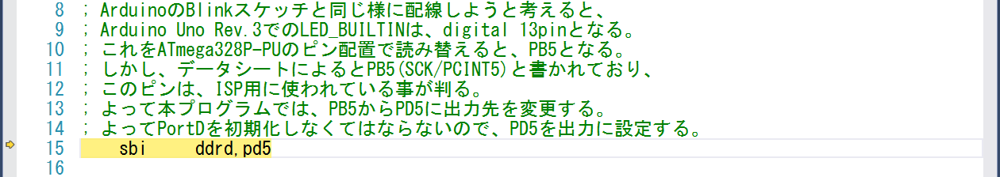
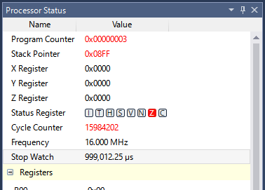
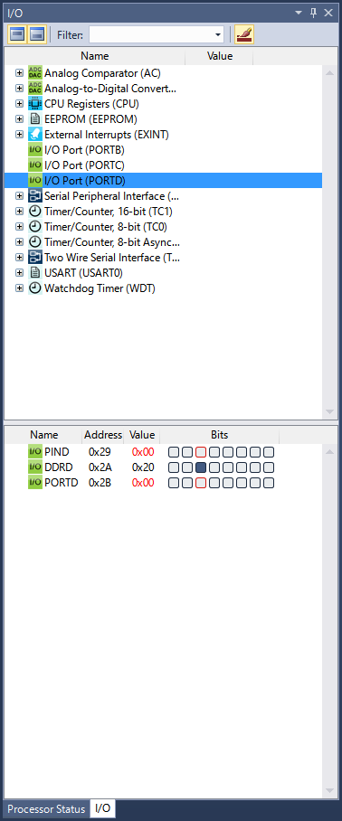

# まずは試してみましょう

[ソフトウェアの準備][PrepSoftware]と[ハードウェアの準備][PrepHardware]が終わったら、まずは試してみましょう。但し、何も知らない状態から始める事を想定しているので、とても説明が長いです。その結果、大長編となりました。どうか頑張って、最後までお付き合い下さい。

まず`IDE`を起動して、以下の様にメニューから**新規プロジェクトを作成**を選択します。


すると、以下の様な**新規プロジェクト作成ダイアログ**が表示されます。


左のペインから、**Installed**の配下にある**Assembler**を選択します。


下のペインの**Name**にプロジェクト名（とソリューション名）として、**BlinkAsm**と入力します。**Solution name**（ソリューション名）は、**Name**を入力した名前と同じ名前が、自動的に設定されますので、入力は不要です。


同じペインの**Location**を確認します。作成したソリューションは、この**Location**フォルダー配下に作成されます。デフォルトで問題はありませんが、今後ソリューションが増えてくると、乱雑になって管理も大変になるので、分かり易いサブフォルダー等を指定しておくのも良いでしょう。以下は、デフォルトから[一連の本記事用][BackToToc]のフォルダー配下に変更した所です。


これで**OK**ボタンを押します。**デバイス選択ダイアログ**が表示されます。


上のペインの**Device Family**プルダウンメニューから、**ATmega**を選択します。


下のペインの一覧をスクロールして、**ATmega328P**を選択します。*ATmega328*とか、*ATmega328PB*という似た様な名前もありますが、間違えないで下さい。


これで**OK**ボタンを押します。ソリューションとプロジェクトが作成されます。遅いPCをお使いの場合は、少し時間がかかるかもしれません。作成が終わると、`IDE`が以下の様になります。各ウィンドウのレイアウトや大きさは、各人によって異なります（自由に移動したりリサイズ出来ます）ので、多少違っていても気にしないで下さい。


コードを書き始める前に、先に環境を設定しておきます。以下の様にメニューを選択して、**プロジェクトのプロパティ**を開きます。


プロパティが表示されました。


プロパティウィンドウの左のペインから、**Tool**を選択します。


プロパティウィンドウの右のペインの**Selected debugger/programmer**で、**Simulator**を選択します。`MCU`にいきなり書き込む前に、まずは`Simulator`でテストする為です。


プロパティの変更を保存して、プロパティウィンドウを閉じます。


コードエディターウィンドウに戻ります。このままの状態でアセンブルして実行しても、動作はしますが、実行内容は**R16レジスタをインクリメントするだけの無限ループ**です。初めての××系では、最初は大抵**Hello World!**か**Lチカ**が主流みたいなので、どちらにしようか悩んだのですが、ここは**Lチカ**で行きたいと思います。

**Lチカ**も、`Arduino`だと`delay()`が使えて、n秒間隔の点滅などは簡単に記述出来るのですが、アセンブリ言語だと**そのようなライブラリは無い**ので、自分で１から記述する事になります。加えて割り込みやタイマーも、まだ[一連の本記事][BackToToc]では学習していないので、原始的で力技ですが待機する命令サイクル数（ステップ数とかクロック数とか言う人も居ます）を**自分で計算して**コードを記述する羽目になります。まぁ習っていないのだから仕方ありません、我慢です。

結果、出来上がったコードは次の様になります。これをコードエディターで入力します。**\;** で始まる行はコメント行ですので、入力しなくても構いませんが、後で見返した時に困るので、ちゃんと書く事をお勧めします。

```
;
; BlinkAsm.asm
;
; Created: 2018/11/06 18:04:49
; Author : neb4nebrin
;

; ArduinoのBlinkスケッチと同じ様に配線しようと考えると、
; Arduino Uno Rev.3でのLED_BUILTINは、digital 13pinとなる。
; これをATmega328P-PUのピン配置で読み替えると、PB5となる。
; しかし、データシートによるとPB5(SCK/PCINT5)と書かれており、
; このピンは、ISP用に使われている事が判る。
; よって本プログラムでは、PB5からPD5に出力先を変更する。
; よってPortDを初期化しなくてはならないので、PD5を出力に設定する。
	sbi		ddrd,pd5

; メインループ処理解説：
; PD5をオン->1秒遅延->PD5をオフ->1秒遅延->最初に戻る
MainLoop:
	sbi		portd,pd5
	rcall	DelayLoop
	cbi		portd,pd5
	rcall	DelayLoop
	rjmp	MainLoop

; サブルーチン解説の前に：
;
; 時間指定の遅延の考え方：
; 16MHzで動作するATmega328P-PUは、1秒間に16,000,000サイクルの命令を実行できる。
; つまり1秒待機するという事は、16,000,000サイクル分の命令を無駄に実行させれば良い。
; 実際に16,000,000きっちり無駄にするには、まずループプログラムを書いた後に、
; その総処理サイクル数を求めて、ループ回数を調整する必要がある。
; なおこの考え方は、水晶が必ず正確に16MHzを発振する事が前提の考え方なので、
; 個体差や温度等による影響で、実際にはかなり誤差があると思われる。
; よって、多少サイクル回数が増減しても、問題はないと思われる。

; 実行する回数が指定されたループの考え方：
; 汎用レジスタは8bitの大きさなので、[0 - 255]までの最大256回しか実行出来ない。
; しかし、ループを入れ子とすると、最大256回 * 256回 = 65536回実行出来る。
; もしこれでも足りないのであれば、さらに桁を足していく事を繰り返す。


; 遅延ループ処理解説：
; まず基本として、各命令のサイクル数を調べる。
; ldi/nop/decは1サイクル命令。
; brneは2サイクル命令
; retは4サイクル命令。
;
; InnerLoop3ラベルから、brne InnerLoop3迄の命令サイクルは、計4サイクル。
; その外側のInnerLoop2ループは、InnerLoop3の分を除くと、計4サイクル。
; さらにその外側のInnerLoop1ループは、同様に計4サイクル。
; 残るサブルーチンの最初と最後は、計5サイクル。
;
; 内部ループ3は、r22 * r21 * r20回実行される。
; 内部ループ2は、r21 * r20回実行される。
; 内部ループ1は、r20回実行される。
; よって内部ループの総サイクル数は、以下の計算式で求められる。
; 内部ループの総サイクル数 =
;	(r22 * r21 * r20 * 4) + (r21 * r20 * 4) + (r20 * 4)
;
; これより総サイクル数は、以下の通りとなる。
; 総サイクル数 = 
;	5 + (r22 * r21 * r20 * 4) + (r21 * r20 * 4) + (r20 * 4)
;
; このコードに設定した値で計算すると、
; 総サイクル数 =
;	5 + (249 * 250 * 64 * 4) + (250 * 64 * 4) + (64 * 4) = 16,000,261
;
; もしお使いのクロック周波数が異なるのであれば、これらの考え方で初期値を再定義する事。
DelayLoop:
	ldi		r20,64
InnerLoop1:
	ldi		r21,250
InnerLoop2:
	ldi		r22,249
InnerLoop3:
	nop
	dec		r22
	brne	InnerLoop3
	dec		r21
	brne	InnerLoop2
	dec		r20
	brne	InnerLoop1
	ret
```

入力が終わったら、コードをセーブしてから、アセンブルします。`IDE`では、アセンブルだのコンパイルだの区別せずに、単に**ビルドする**と言います。


**Build Solution**を選択するとビルドが開始され、結果が**Outputウィンドウ**に表示されていきます。正常に終了すると、次の様に表示されます。


このウィンドウを見つけられない場合は、以下の様に**Output**メニューを選択して下さい。


Outputウィンドウに**Build succeeded**以外の出力が表示されたなら、環境もしくは入力したソースコードに問題があります。

もし環境に問題があるならば、前の手順に戻って、プロジェクトのプロパティを再確認します。もしソースコードに問題があるならば、以下の様に**Error Listウィンドウ**に問題点が表示されます。


このウィンドウを見つけられない場合は、以下の様に**Error List**メニューを選択して下さい。


`IDE`ならではの機能ですが、このError Listウィンドウの行を選択して、ダブルクリックすると、直ちにコードエディターを表示して、問題のある行に移動してくれます。これで直ぐに修正作業に移る事が出来ます。


ビルドが正常に終了するまで、注意深く修正作業を行ってください。上の画面キャプチャーで、コードエディターに色がついているのが判ると思います。コメント行は緑、`MCU`への命令は青、命令に対するオペランドやラベル等は黒です。青にならなければならないのに、黒で表示されている等、基本的なミスは色でも判ります。`IDE`ならではの便利な機能を利用して、少しでも楽に開発を進めましょう。

ビルドが正常終了したら、次は`Simulator`を用いて動作テストをします。以下の様に**Start Debugging and Break**メニューを選択します。


すると、以下の様にデバッグ用ウィンドウレイアウトに自動的に切り替わり、コードの先頭位置で実行が中断した状態となります。


コードのデバッグを開始する前に、デバッグに用いるウィンドウを用意します。全てのウィンドウの位置や大きさは、各人の環境で異なると思いますが、`IDE`では各ウィンドウをそれぞれ好きな位置に配置したり、ドッキングしたりする事が出来ますので、もし見当たらない場合は、よく探してみて下さい。探しても見つけられない方の為に、今回用いるウィンドウの開き方も載せます。

まず必要となるのは、`MCU`の状態を表す**Processor Statusウィンドウ**です。ここにはプログラムカウンターや各種汎用レジスターが表示される他、`Simulator`の動作クロックを設定したり、自分の知りたい範囲のコードを実行した結果のサイクル数が表示されていたりします。


このウィンドウを見つけられない場合は、以下の様に**Processor Status**メニューを選択して下さい。


今回のソースコードは、**16MHz**で動作する事を前提としていますので、`Simulator`のクロック周波数を変更します。**Frequency**の値（**1.000MHz**となっている箇所）をクリックすると、以下の様に修正可能になります。


これを**16.000MHz**に修正して**Enter**キーを押すと、以下の様に赤字で表示されて確定されます。


次に必要となるのは、`I/O`の状態を表す**I/Oウィンドウ**です。プロジェクトを作成した時に`ATmega328P`を選択しているので、最初から`ATmega328P`が使える`I/O`だけが表示されています。


このウィンドウを見つけられない場合は、以下の様に**I/O**メニューを選択して下さい。


今回は、**Port D**の**5番ピン**を用いますので、**I/O Port (PORTD)** を選択します。


すると、**I/O**ウィンドウの下ペインに**Port D**の詳細が表示されます。データシートにも記載されていますが、リセット直後の**Port D**の状態は、全て値（**Value**の欄です）が**0x00**となっています。つまり全て入力ピン（内蔵プルアップ抵抗無し）として設定されています。`PIND`と`DDRD`と`PORTD`の詳細は、後の章で学ぶので省略しますが、ざっくり説明（本当はもう少し面倒くさい）すると、`PIND`が入力ピンの扱いで、`DDRD`が入出力方向指定レジスタとなり、`PORTD`が出力ピンの扱いとなります。`Arduino`でもそうした様に、Portの設定はコード中に記述します。

以上が、今回用いるデバッグ用のウィンドウとなります。

次に**Breakpoint**を学習しましょう。今回作成した**DelayLoop**サブルーチンは、1秒待機するループです。後述するステップ実行を1秒に相当するサイクル数分回すのは、手が疲れるだけでは済まないでしょう。加えて`Simulator`を使っているので、どんなに速いPC上で動かしたとしても、実機と同じように16,000,000サイクルを1秒でシミュレートする事は不可能です。そういった訳で、1回のデバッグである程度の量（ブロックとかでも良い）のコードが動いている事が確認出来たら、一度デバッグ実行を終了し、次回のデバッグ実行の時には、次に中断させて状態を確認したいコードの部分をマークしておき、既に確認済み部分は普通に実行させて早送りするのです。この**止めたい位置**の事を**Breakpoint**と呼びます。

Breakpointの作り方は簡単です。止めたい命令のある行をクリックして選択した後、右クリックメニューから**Insert Breakpoint**を選択します。


設定されたBreakpointは、以下の様に、行番号の前に塗りつぶした赤丸として表示されていて、行が赤で強調表示されています。


Breakpointは、とても頻繁に設定・解除を行うので、毎回メニューから操作するのも面倒です。そこで、簡易手段を使います。コードエディター上で、背景色が異なる行番号の前の部分をクリックするだけで、設定・解除がトグルされます。


上記赤丸部分をクリックすると、


Breakpointが簡易設定されました。解除も同じ方法で、赤丸をクリックします。これでBreakpointを使って、実行を中断させる方法を学びました。次に移る前に、**今設定した全てのBreakpointを解除**して下さい。

さて、いよいよデバッグを開始します。今、プログラムは先頭の位置で中断されています。この位置は、コードエディターでBreakpointを簡易設定したのと同じ位置に、黄色の矢印として表示されていて、行が黄色で強調表示されています。



この強調表示された行が、**次に実行される命令**となります。つまり、まだ何も実行されていません。そしてこの、**中断されている**状態と、**実行（デバッグ）を終了している**状態を勘違いしないで下さい。実行を終了している状態では、一部のウィンドウが表示出来ません（自動的に閉じてしまいます）し、コードエディター上で黄色の矢印と行の強調表示もされません。

またデバッグ中に、コードエディターでコードを修正しても、**今のデバッグ状態を継続したまま新しいコードを入力して試す**事も出来ません。修正する時は、一度デバッグを終了します。コードを修正後にビルドし直して、再びデバッグする必要があります。

では、最初の命令を実行してみましょう。ステップ実行には幾つか種類があり、それぞれ次の様な特徴があります。

- Step Into
  
  次に実行する命令がサブルーチンコール（C/C++の場合は、関数やメソッドのコールも含む）の場合は、そのサブルーチンの先頭を次の中断位置とする。サブルーチンコールではない場合、次の中断位置は、大抵次の行の命令となる。

- Step Over
  
  次に実行する命令がサブルーチンコールの場合は、次の中断位置は、そのサブルーチンから戻ってきた次の命令（大抵今の中断位置の次の行にある）とする。サブルーチンコールではない場合は、Step Intoと同じ。

- Step Out
  
  現在サブルーチン内部を実行中の場合、次の中断位置は、そのサブルーチンから戻った（要は呼び出し元の）次の命令とする。もしメインルーチンでこれを実行した場合、どこかにBreakpointがなければ中断する事はない。

まずは基本の**Step Into**です。最初の命令`sbi		ddrd,pd5`は、サブルーチンコールではないので、この状態で**Step Into**すると、次の中断位置はラベル`MainLoop`の次の行（ラベルは命令ではありません）の`sbi		portd,pd5`となりそうです。やってみましょう。それぞれのステップ実行は、Debugメニューの中にあります。


Breakpointと同様に、毎回メニューから操作をするのは面倒です。ここはショートカットキーやツールバーの出番です。ショートカットキーは、表示されたメニューに書いてあるので省略します。**Debugツールバー**は、次の様に表示されています。


このツールバーが見つからない人は、ツールバー領域で右クリックメニューから、**Debug**を選んでください。


ツールバーの各アイコンの上にマウスカーソルを移動すると、それぞれ意味が表示されますので、各アイコンの説明は割愛します。以下は、**Step Into**を実行した結果です。


予想した通りの結果となりました。同様に今度は**Step Over**すると、次の中断位置は`rcall	DelayLoop`となりそうです。やってみましょう。


予想した通りの結果となりました。次の命令は`rcall	DelayLoop`なので、サブルーチンコールとなります。ここで**Step Into**すると、次の中断位置はラベル`DelayLoop`の次の行の`ldi		r20,64`となりそうです。やってみましょう。


予想した通りの結果となりました。この先は、1秒を待機するループ処理です。折角サブルーチン内部に入ったのだから、**Step Out**を試してみたい所ですが、実際に自分で試した所、うんざりする程長時間待たされる結果となってしまいました。なので、**Step Out**機能は封印して、先に習った**Breakpoint**を使います。更についでに、このループの処理時間を計算させてみましょう。

まず**Processor Status**ウィンドウで、**Stop Watch**の行の上で、右クリックメニューを表示し、**Reset Stop Watch**を選択します。


**Stop Watch**が初期化出来たので、次にサブルーチンからの戻り先にBreakpointを設定します。


今度はステップ実行ではなく、**Continue**（続けて実行）をします。もちろんメニューからではなく、ツールバーの同じアイコンを押しても問題ありません。


この操作は少し待たされると思います。が、**Step Out**よりもずっと早く終わります。


中断したら、**Processor Status**ウィンドウの**Stop Watch**の値を確認します。



**999,012.25us**（マイクロをuと表記）となっています。**1秒＝1,000,000マイクロ秒**ですので、約1秒経過している事が判ります。よって、処理の妥当性が証明されました。

次の命令は`cbi		portd,pd5`となっていますが、これも**Step Into**します。


次の命令が`rcall	DelayLoop`なので、ここで**Step Over**すると、次の中断位置は`rjmp	MainLoop`となりそうです。やってみましょう。


これも少し待たされますが、ちゃんと次の行の命令で中断しています。`rjmp`はジャンプ命令なので、次の実行は`MainLoop`の先頭に戻る事になります。ここまでに大きな動作確認が出来ましたが、まだ確認出来ていないのは、**Port Dの動作**です。

ここで、Breakpointをさらに追加します。今中断している状態で`rjmp	MainLoop`にBreakpointを設定します。すると、この様になる筈です。


現在の**Port D**の状態を、`I/O`ウィンドウで確認しましょう。


**Port D**の**5番ピン**（つまり**Name**が**PORTD**となっている**Value**（値）を見て、最下位bitを0bit目とした時の**5bit目**）が**0**となっているので、`Arduino`で書く所の`LOW`となっています。ここで**Continue**すると、`MainLoop`の先頭に戻り、`sbi		portd,pd5`を実行し、最終的に次のBreakpointである`cbi		portd,pd5`で中断すると予想されます。`sbi`命令は、指定された`I/O`の指定されたビットをセット(Set BIt)する命令です。つまり、ここで**Port D**の**5番ピン**を**1**にします。これは`Arduino`で書く所の`HIGH`です。やってみましょう。


中断したので、`I/O`ウィンドウを確認します。


**Port D**の**5番ピン**が**1**になりました。このまま**Continue**すると、`cbi		portd,pd5`が実行されて、最終的に次のBreakpointである`rjmp	MainLoop`で中断すると予想されます。`cbi`命令は、指定された`I/O`の指定されたビットをクリアー(Clear BIt)する命令です。つまり、ここで**Port D**の**5番ピン**を**0**にします。これは`Arduino`で書く所の`LOW`です。やってみましょう。


中断したので、`I/O`ウィンドウを確認します。



**Port D**の**5番ピン**が**0**になりました。これで`MainLoop`のコメントに書いた仕様（PD5をオン-&gt;1秒遅延-&gt;PD5をオフ-&gt;1秒遅延-&gt;最初に戻る）が、全て正しく動作する事が判りましたので、`Simulator`でのテストを終了しましょう。

デバッグを終了するには、**Stop Debugging**を選択します。もちろんメニューからではなく、ツールバーの同じアイコンを押しても問題ありません。


もし、ここまでの何処かで想定した動作とならなかった場合は、書いたコードに問題があります。大抵の場合、ミスタイプが原因です。例えばレジスタの名前を間違っている（例：`r16`-&gt;`r17`）・似た様な命令（例：`brne`-&gt;`brie`）に打ち間違えて意図した処理になっていない等です。こうなった場合は、直ちにデバッグを終了し、ソースコードを確認・修正した後、ビルドしなおしてから再デバッグを行います。そして全てが正しく動作するまでこの手順を繰り返します。

と、この様な感じで動作テストは進みます。アセンブリ言語の場合、それぞれの命令が実行する結果は、とても単純です。ですから、ある程度の命令を纏めて１つの機能ブロックと考えて、それぞれの実行結果を確認していくと良いと思います。そういった理由で、ソースコードには、機能ブロック単位でコメントを記述しています。

最後にソースコードの各機能を説明すると、ソースコードの先頭部分（1行しかありませんが）は初期化コードで、`Arduino`でいう所の`setup()`に該当します。`MainLoop`から始まり`rjmp`で終わる部分はメインルーチンで、`Arduino`でいう所の`loop()`に該当します。`DelayLoop`から始まり`ret`で終わる部分は、`Arduino`でいう所の`delay()`関数に相当するユーザー定義のサブルーチンとなります。また、今回は`DelayLoop`の詳細動作についての動作テストを割愛しましたが、もし興味がありましたら、汎用レジスタ(r20, r21, r22)に対する初期値(64, 250, 249)を、デバッグ用に(1, 1, 1)と書き換えてテストすると良いと思います。ループ処理の動作が確認出来たら、元の初期値に戻せば良いのです。

さて、次はMCUボードを用いて動作させてみましょう。MCUボードがまだ用意出来ていない方は、記事を最後の方までずっと進めて、`MCU`上のメモリサイズの確認に進んで下さい。

まず最初に**ソースコード中のBreakpointを、全て解除**します。

次に、実行する環境を`Simulator`からプログラマー（に接続してあるMCUボード）に変更します。この記事の最初でやった通りにして、もう一度**プロジェクトのプロパティ**を開きます。そして、**Tool**の**Selected debugger/programmer**を、用意したプログラマー（この場合は**STK500**）に変更します。**Interface**は**ISP**に設定します。


変更を終えたら、**プロジェクトのプロパティ**を**保存してから**閉じます。

もしMCUボードを自作して、新品で1度も使用していない`MCU`を取り付けた場合、`MCU`が内蔵オシレータを使って動作する設定となっているので、これを外部の水晶振動子を用いる様に、`Fuse`ビットを書き換える必要があります。この作業手順は、新品の`MCU`を使う最初の1回だけ必要です。製品のMCUボードを利用する方は、大抵設定済み`MCU`が付属していると思います。まずは、お手持ちのマニュアル等を参考にして下さい。設定済みのMCUボードを利用する方は、ブレッドボードにLEDと抵抗を接続する手順に進んで下さい。未設定のMCUボードを利用する場合は、この手順を参考にして、ご自身で設定して下さい。

まず最初に知らなくてはいけない事は、データシートによると、出荷時の`MCU`はデフォルトクロックソースとして内蔵オシレータ(8MHz)が有効で、`CKDIV8`という`Fuse`がプログラムされている、と記述されています。この結果、出荷時の`MCU`は**1MHz**で動作します。つまり、水晶振動子や外部オシレータを`MCU`に接続しただけでは、そのクロック周波数では動作しないのです。以下に、新品の`ATmega328P-PU`の`Fuse`ビットと`Lock`ビットを、ICライターで読み出した結果を示します。


`Fuse`ビットは、**1**の場合が**未プログラム**状態で、**0**の場合が**プログラム**状態となります。画像内で、例えば`CKDIV8=0`と書いてあるのは、**チェックマークが入っていたらプログラム状態で、それは0である**事を意味します。つまりチェックマークが無いなら、**1**を表します。

読み方を理解したら、データシートに戻ります。`CKSEL3`から`CKSEL0`までを、`CKSEL3`が最上位ビット(MSB)となる様に並べると、4bitの値が出来ます。これを`CKSEL[3:0]`の様に記述します。上の読み取り結果の`CKSEL[3:0]`は2進数で**0b0010**と表現出来るので、これをデータシートの`13.2 Clock Sources`を参照すると、`Calibrated Internal RC Oscillator`が選択されている事が判ります。また、`CKDIV8`がプログラムされているので、クロックソースを8分周する事も判ります。`13.6 Calibrated Internal RC Oscillator`を調べると、確かに結果として大体**1MHz**として動く事が判ります。加えて`SUT[1:0]`が**0b10**となっているので、**Power Conditions**が**Slowly rising power**で、**Start-Up Time from Power-down and Power-Save**が**6CK**で、**Additional Delay from Reset**が**14CK + 65ms**に設定されている事も判ります。これらの値は、電源投入直後等（回路が不安定です）から、内蔵オシレータ起動をどれだけ待つか？を表しています。

次に自分のMCUボードです。`XTAL1`ピンと`XTAL2`ピンに**16MHz**の水晶振動子と**22pF**のセラミックコンデンサーからなる発振回路を接続しています。データシートの`13.1 Clock Systems and Their Distribution`を参照すると、`XTAL1`と`XTAL2`ピンに接続した`Crystal Oscillator`というパターンになります。このパターンと`13.2 Clock Source`と`13.3 Low Power Crystal Oscillator`と`13.4 Full Swing Crystal Oscillator`を参照した結果、MCUボードを**Low Power用に設計していない**ので、`Full Swing Crystal Oscillator`が該当する事になります。つまり、`13.4 Full Swing Crystal Oscillator`を参照して値を決める事になります。まず`CKSEL[3:1]`（最下位ビット(LSB)の値が**1**となっている事に注意）の値は**0b011**となります。次に残っている`CKSEL0`と`SUT[1:0]`の値も決めます。このMCUボードは特殊用途ではないので、`MCU`の起動タイミングをシビアにする必要もありません。つまり、基本的に出荷時動作（汎用設定）と同じ様な動作で問題はありません。よって内蔵オシレータの設定を流用して、**Oscillator Source/Power Conditions**が**Crystal Oscillator, slowly rising power**で、**Start-Up Time from Power-down and Power-save**が**16K CK**で、**Additional Delay from Reset**が**14CK + 65ms**である行を参照すると、`CKSEL0`が**1**で、`SUT[1:0]`が**0b11**と記述されています。また**16MHz**でそのまま動作させるので、このクロックを分周する必要はありません。これらの結果から、最終的に設定する値は、`CKSEL[3:0]`が**0b0111**で、`SUT[1:0]`が**0b11**で、`CKDIV8`が**1**となります。

設定する値が決まったので、MCUボードとプログラマーとPCをそれぞれ接続し、通電します。`IDE`に戻って、**Available Tools**ウィンドウからプログラマーを右クリックし、**Device Programming**を選択します。


[ハードウェアの準備][PrepHardware]で行った様にして`MCU`ボードと通信を行い、`Fuse`ビットを読み出します。


**LOW.CKDIV8**のチェックを外します。そして**LOW.SUT_CKSEL**を**Ext. Full-swing Crystal\; Start-up time PWRDWN/RESET: 16K CK/14 CK + 65 ms**に変更します。


変更した箇所のアイコンが、緑のチェックマークから、黄色の注意マークに変わります。この2か所以外に黄色マークがあった場合は、**Read**ボタンを押して元の値に戻して下さい。**LOW**の値が**0xF7**となっているか確認したら、**Program**ボタンを押して書き込みます。


`Fuse`ビット変更に対する**Warning（警告）ダイアログ**が表示されます。**Continue**ボタンを押して継続します。以前に一度でも**Don't show this warning again**にチェックを入れていた場合は、このダイアログは表示されずに書き込みが行われますので、注意して下さい。


`Fuse`ビットの書き込みが完了すると、黄色マークが緑マークになります。**Close**ボタンを押して、ダイアログを閉じます。もし書き込みに失敗した場合は、書き込む電圧が不安定である位しか思いつきません。自分の使っているプログラマーは、PC上で書き込んだ時のボードの電圧を確認する事が出来ます。以下は、今回`Fuse`ビットを設定した時の、MCUボードの電圧です。


`MCU`への`Fuse`ビット設定が終わったら、MCUボードへの通電を止めます。

次は、ブレッドボード等を使用してLEDと抵抗を直列に接続し、それぞれの両端をMCUボードの**PD5**と**GND**に接続します。この時LEDの極性に注意して下さい。もしLEDや抵抗をお持ちでない場合や、何を使えば良いのか判らない場合は、以下の説明を参考に購入 or 計算して下さい。

今回私が使用したLEDは、`OptoSupply`というメーカー製の`OSR5JA3Z74A`という3mmの赤色LEDです。`OptoSupply`のLEDは、秋月電子通商で簡単に入手出来、データシートも公開（秋月電子通商の商品ページにリンクあり）されているので、良く判らないLEDを使うよりも使いやすいと思います。

[３ｍｍ赤色ＬＥＤ　７０°　ＯＳＲ５ＪＡ３Ｚ７４Ａ](http://akizukidenshi.com/catalog/g/gI-11577/)

LEDに流れる順方向電流を$I_{\rm F}$(A)、LEDの順方向電圧降下を$V_{\rm F}$(V)、電源電圧を$V_{\rm CC}$(V)と表記すると、LEDに接続する抵抗の値$R_{\rm LED}$($\Omega$)は、以下の式で表現出来ます。

$$ R_{\rm LED} = \frac{V_{\rm CC} - V_{\rm F}}{I_{\rm F}} $$

LEDのデータシートを確認すると、順方向電流$I_{\rm F}$が**20mA**の時、平均(Typ.)順方向電圧降下$V_{\rm F}$が**2.1V**である事が判りました。しかし、実際にこれらの値を用いて試してみましたが、眩しすぎる位明るくなったので、$I_{\rm F}$を**3mA**としました。これより求める抵抗の値$R_{\rm LED}$は、以下の通りとなります。

$$ R_{\rm LED} = \frac{5 - 2.1}{0.003} = 966.\dot{6} $$

実際に接続する抵抗値は、計算結果より大きくて一番近い値を用います。**逆に計算結果より小さくて一番近い値を選択してしまう**と、流れる電流が計算よりも多くなる事を意味するので、最悪の場合（データシートの$I_{\rm F}$の最大値を超えた場合）LEDが壊れます。大きくて一番近い値を選択すれば、計算よりは多少暗くなるかもしれませんが、壊れる事もありません。もしくは、複数の抵抗を直列と並列に組み合わせて、計算結果に等しい抵抗値を作り出しても良いのですが、あまり現実的ではありません。よって、今回は一番近い1k$\Omega$（カラーコード：茶黒赤金）を１つだけ用います。

LEDの抵抗値が求まったので、今度はこの抵抗の消費電力を計算します。LEDに接続する抵抗の消費電力$W_{\rm R}$(W)は、以下の式で表現出来ます。

$$ W_{\rm R} = I_{\rm F} \times I_{\rm F} \times R_{\rm LED} $$

つまり今回の消費電力は、以下の通りとなります。

$$ W_{\rm R} = 0.003 \times 0.003 \times 1000 = 0.009 $$

**9mW**という事は、**1/6W**($=166.\dot{6}\rm mW$)抵抗で充分という事になります。小さな組み込み機器を作成するなら、部品も小さい方が都合が良いので、**1/6W**抵抗を使いましょう。これも秋月電子通商で（100本単位ですが）買えます。

[カーボン抵抗（炭素皮膜抵抗）　１／６Ｗ　１ｋΩ　（１００本入）](http://akizukidenshi.com/catalog/g/gR-16102/)

パーツの選定が終わったので、LEDと抵抗をブレッドボードに配線しましょう。


電子工作のお約束には、**赤は電源・黒はGND**というのがあり、これに従ってジャンプワイヤーを使っています。別に守らなくても電気的に問題はないのですが、パッと見て黒は**GND**というのが理解出来ると、接続の際に極性を間違える事も少なくなると思います。それ以外の信号線については、赤・黒以外の自分の好きな色を使えば良いと思います。今回は、MCUボードの**PD5**と**GND**に接続するので、上記の写真では、緑のジャンプワイヤーを**PD5**に、黒のジャンプワイヤーを**GND**にそれぞれ接続します。MCUボードへの電力供給は、まだしないで下さい。


この様な感じで接続しました。写真ではプログラマーが既に通電されていますが、ここからMCUボードへの電力供給は行っていませんので、この時点では`MCU`は動作していません。

次にMCUボードへ電力供給を行います。私のMCUボードは、シリアル変換アダプターから電力供給を行うので、ここでシリアル通信アダプターをPCと接続します。プログラマーから電力供給したり、それ以外の外部電源を用いる方も、この時点から電力供給します。また、プログラマーもPCと接続して、ハードウェアが全て動作可能な状態として下さい。

ここから`IDE`に戻ります。

これで漸く書き込める状態となりました。今までとは違って、今度は**Start Without Debugging**（デバッグ無しで実行）を選択します。今まで使ってきた**Debugツールバー**には、このアイコンは**ありません**ので注意です。


このアイコンは**Standardツールバー**にあります。


多分最初から表示されていると思いますが、見つからない方は、ツールバー領域を右クリックして**Standard**を選択して下さい。


では、書き込んで実行してみましょう。

<iframe width="560" height="315" src="https://www.youtube-nocookie.com/embed/Bc2xpceHXSc" frameborder="0" allow="accelerometer; autoplay; encrypted-media; gyroscope; picture-in-picture" allowfullscreen></iframe>

動画では、大体1秒間隔でLEDが点滅している事が判ります。これでアセンブリ言語で記述する、`ATmega328P-PU`の**Lチカ**プログラムが完成しました。

最後に、このプログラムが使った`MCU`上のメモリサイズを確認してみましょう。`IDE`の**Solution Explorer**ウィンドウで、**Output Files**配下の**BlinkAsm.lss**というファイルをダブルクリックして開きます。


このウィンドウが見つからない方は、以下の様にメニューを選択します。


開いたlssファイルの一番最後の行に移動します。


**.cseg**の行はコードセグメント（要は`Flash`です）に格納されるコードやデータを表しています。この場合、コードだけ**34byte**分使っています。**.dseg**の行はデータセグメント（要は`SRAM`です）を表しています。今回は`SRAM`にコードやデータ領域を作成していないので、コードもデータも**0byte**です。**.eseg**の行は`EEPROM`セグメントを表しています。これも同様に作成していないので、どちらも**0byte**です。結局、このプログラムは`Flash`を**たったの34byte**しか使っていません。今回のコードと同様の処理をC/C++で記述すると、これよりもずっと大きなサイズを消費します。組み込み用に用いる小さな`MCU`は、搭載しているメモリの量も小さい事が多く、C/C++で記述するとメモリに収まらない事も多いのです。試しに`Arduino`で**Blinkスケッチ**を何も変更せずにコンパイルしてみましょう。


`Flash`を**928byte**、`SRAM`を**9byte**使っている事が判りました。アセンブリ言語で記述するメリットの一つに省メモリが挙げられるのは、この結果を見ても明らかです。勿論デメリットもありますから、結局はアセンブリ言語とC（出来たらC++も）の両方を使い分けられる様になる事が大事です。今後は、出来るだけアセンブリ言語とCの両方で学習したいと思っています。

補足ですが、今回作成したプロジェクトは、[GitHub][BlinkAsmSource]にアップロードしてあります。どうしても動作しない場合は、こちらを参考にして下さい。

2018/11/16
***
目次は[こちら][BackToToc]

[BackToToc]: ../toc.md "目次に戻る"
[PrepSoftware]: ./Software.md "ソフトウェアの準備"
[PrepHardware]: ./Hardware.md "ハードウェアの準備"
[BlinkAsmSource]: https://github.com/neb4nebrin/AtmelStudioDevelopment/tree/master/Chapter1/Projects/BlinkAsm "BlinkAsm (GitHub)"

