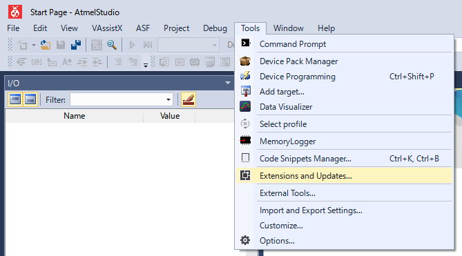
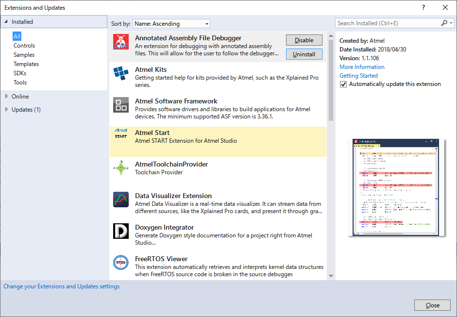
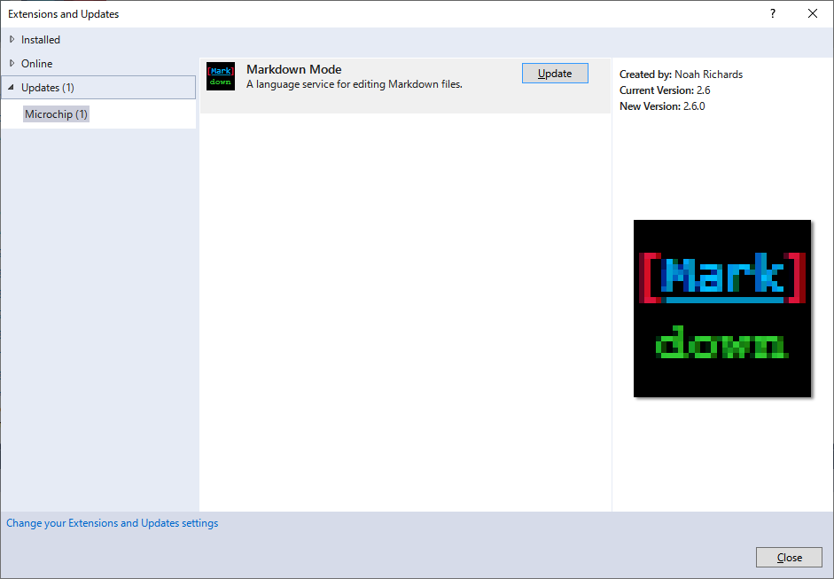
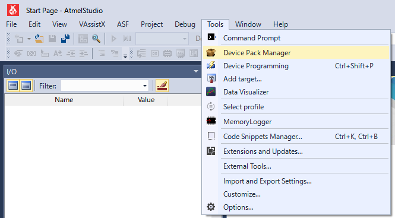
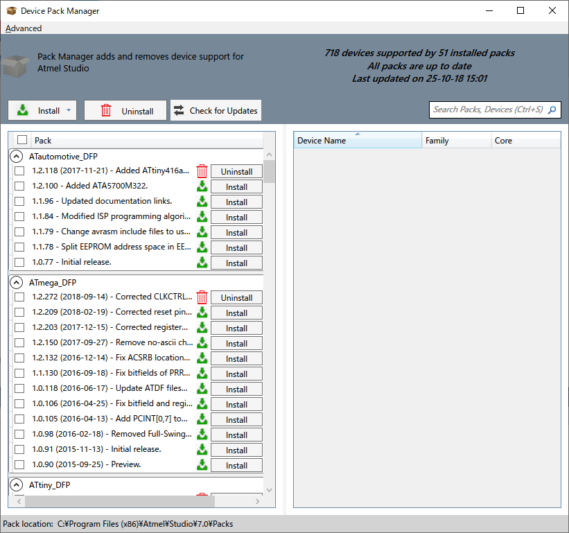
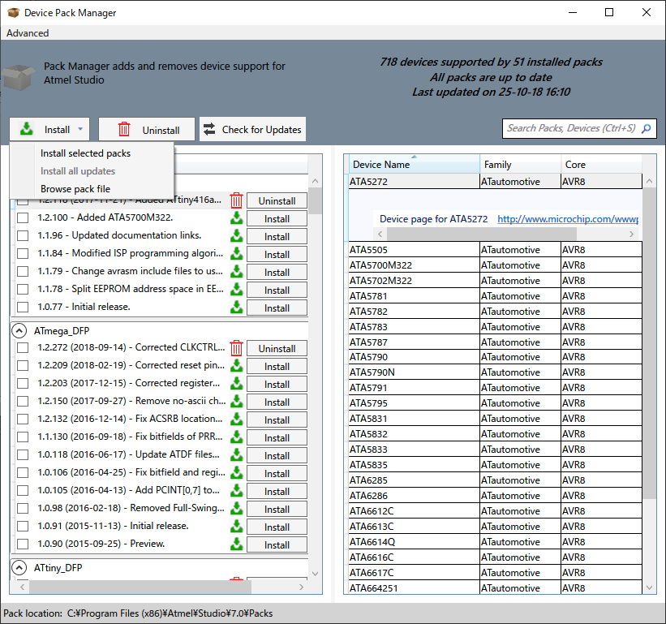
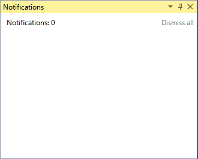

# ソフトウェアの準備

[Atmel Studio 7.0で行うAVR開発][BackToToc]の一連の記事では、`IDE`として`Atmel Studio 7.0`（以後`IDE`と表記）を使用します。`Microchip`（旧`Atmel`）のHPから無償でダウンロード出来ます。`PIC`の開発環境とは違い、有償版はないので、いつでも全ての機能を利用する事が出来ます。`Microchip`のHPは[こちら][MicrochipHP]。

HPが更新されてしまい、記事が無用とならない様に、具体的なDLリンクへのページ遷移は省略しますが、HP上の検索ボックスで "Atmel Studio 7" を検索すると見つけられると思います。

*Note: `MCU`（参照：ハードウェアの準備：別途記述）として`ATmega328P-PU`を用いるので、HP上の検索ボックスで`ATmega328P`の製品ページを検索し、**Document**の様なリンクを辿り、`ATmega328P`のデータシートもついでに入手しておきます。データシートには、**Summary**と呼ばれる簡易版がありますが、こちらではなく完全版を入手します。*

`Atmel Studio 7.0`のインストーラ（Webインストーラでもオフラインインストーラのどちらでも構いません）をDLし終わったら、早速インストールします。

*Note: `Atmel Studio 7.0`は、`Microsoft Corp.`の`Visual Studio IDE`をベースに開発されているので、`Windows`で`Visual Studio`を使ったことがある方は、一目で大まかな機能が利用出来ると思います。しかし`Visual Studio`を一度も使ったことが無い方は、何度も`Microsoft Corp.`のHPで、`Visual Studio`の使い方を学ぶ必要があるかもしれません。`Visual Studio`のHPは[こちら][MicrosoftHP]。*

インストールが終わったら、早速起動します。そしてソフトウェアのアップデートを行います。アップデートは、以下の画像の様に、**Extensions and Updates**メニューを選択します。

すると、以下の様なアップデートダイアログが表示されます。

左のペインから**Updates**を選択します。

ここに表示されている機能拡張は全て更新し、`IDE`を**常に**最新の状態にして使用して下さい。更新は、`IDE`を終了しないと始まらないものがあるので、画面に表示されている指示に従って下さい。*注意: 上の画像で表示されている**Markdown Mode**機能拡張は、標準ではインストール**されていないので、表示されません**。ご自身のダイアログに表示されている機能拡張で読み替えて下さい。*

`IDE`や機能拡張の更新が終わったら、追加で必要と思われる機能拡張をインストールします。インストーラのバージョンにより、何が最初からインストールされているのか判らない為、私が現在インストールしている機能拡張リストを以下に示しますので、これを参考に必要であればインストールして下さい。インストールするには`IDE`を再起動して、再び**Extensions and Updates**メニューを選択します。

- Annotated Assembly File Debugger
- Atmel Kits
- Atmel Software Framework
- Atmel Start
- AtmelToolchainProvider
- Data Visualizer Extension
- Doxygen Integrator
- FreeRTOS Viewer
- GdbConsole
- Indent Guides
- LiveWatch
- LUFA Library
- Markdown Mode
- MemoryLogger
- Microchip Gallery
- Microsoft Advertising Framework (Windows開発用ですが、アンインストール出来ません。)
- Microsoft Store Services Engagement Framework (Windows開発用ですが、アンインストール出来ません。)
- Terminal for Atmel Studio
- Visual Assist for Atmel Studio
- Visual Studio Extensions for Windows Library for JavaScript (Windows開発用ですが、アンインストール出来ません。)

*注意: これら機能拡張の一覧は、私の現時点の環境での一覧であり、私の必要に応じて追加・削除しています。今後の一連の記事で、必ず全て使用する訳ではありません。*

機能拡張のインストールが終わったら`IDE`を再起動して、**Device Pack Manager**を起動して、各デバイスの情報（定義情報）を最新に更新します。これを行わないと、定義情報にバグがあった場合、修正されずにそのまま利用する事を意味します。以下の様に
**Device Pack Manager**メニューを選択します。起動には、`Windowsの管理者権限`が必要です。

起動したら、以下の様なウィンドウが表示されます。全画面で表示されますが、大きすぎるのでウィンドウを縮小しました。

**Check for Updates**ボタンをクリックし、アップデータをチェックします。アップデータがある場合は、**Install**ボタンをクリックして表示されるメニューから、**Install all updates**を選択します。基本的に最新のデバイス定義を用いるので、全ての更新が終わったら、それぞれの古いバージョンは**Uninstall**して構いません。全ての作業が終わったら、**Device Pack Manager**ウィンドウを閉じて下さい。

これで、基本的なソフトウェア環境が出来ました。今後`IDE`を起動する度に、更新のチェックが自動的に行われ、更新があれば`IDE`ウィンドウの右上に通知されます。

この通知アイコンが**強調表示**されると利用可能な更新があるので、この通知アイコンをクリックして表示される通知ウィンドウ（以下の写真：**通知なし**ですが）を読んで、指示に従って更新して下さい。

2018/10/25
***
目次は[こちら][BackToToc]

[BackToToc]: ../toc.md "目次に戻る"
[MicrochipHP]: https://www.microchip.com/ "Microchip Homepage"
[MicrosoftHP]: https://visualstudio.microsoft.com/ "Visual Studio Homepage"

