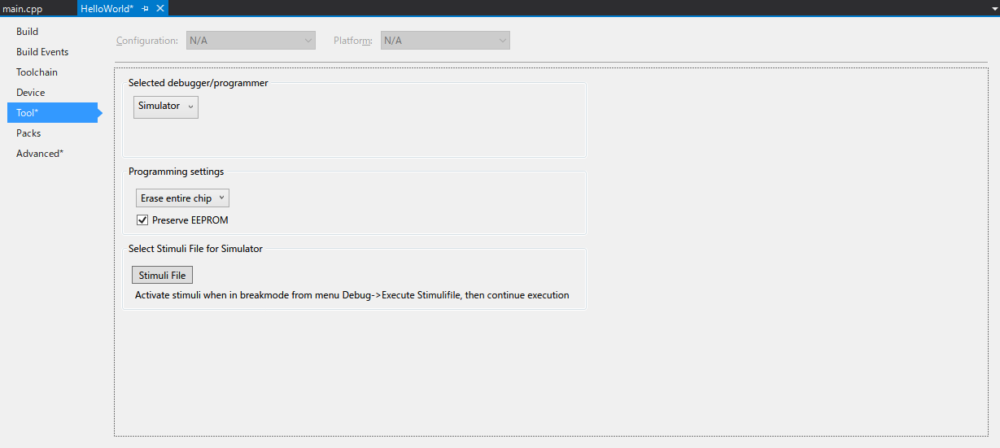

# C++を使うという事は？

あれこれと考慮した結果、`C++`を使います。理由は`C言語`と`アセンブリ言語`に関しては、既に多数の解説があるからです。

しかし悲しい事に、組み込み開発で`C++`を利用しようとすると、猛烈に怒り出す方々が一定数います。これも良く考えると、そもそも本記事が業務用途（費用対効果を考えてメモリ容量の削減等の制約があります）を考慮する必要はないですし、ホビー用途でそんな事を言われる筋合いもありません。

`AVR`は小規模な`MCU`である事に加え、ハードもソフトも必要ならば全て自前で揃える事が出来るので、学ぶには最適な環境だと思っています。なので本記事では、`C++`を使うメリットと、何故`C++`を使うと怒られるのかを学ぼうと思います。

そうと決まったので、`Atmel Studio 7.0`に含まれる`C++`の機能を調査した所、大まかに以下の様な結果になりました。

- `GCC 5.4.0`

  - `C++ 14`まで対応（実験的実装である`C++ 17`を除く）
  - `libstdc++`がない

    *注：`GCC`の最新（開発中を除く）は、現時点(2020/03/07)で`9.2.0`であり、これは`C++ 17`まで対応（実験的実装である`C++ 20`を除く）*

- `avr-libc 2.0.0`

  - `C++`用の機能対応が不十分
  - 全くメンテナンスしてないと思われる機能が存在
  - ソース`avr-libc-2.0.0.tar.bz2`にパッチを適用しようとすると、エラーが出る箇所がある

**プログラミング言語は常に最新の仕様を使いましょう**、がモットーの私としては、このままでは問題点だらけです。

- `C++ 17`を使いたい
- `C++`の本当に使いたい機能（type_traits等）の殆どは`libstdc++`の上に成り立っている
- `avr-libc`を用いずに、共通ランタイム(crtxxxx.o)等を記述する自信も時間もない

これらを解決する為に、`GCC 9.2.0`とその`libstdc++`を含む最新ツールチェーンを自分で作成して、このツールチェーンを`Atmel Studio 7.0`に読み込ませる事で対応しました。

作成プラットフォームは`msys2`で行い、ここで以下のツール・ライブラリ等を作成しました。

- winpthreads-1.0（`mingw-w64-v7.0.0`に含まれています）
- binutils-2.33.1
- gcc-9.2.0（`AVR`用`libstdc++`対応の改造バージョン）
- avr-libc-2.1.0（`2.0.0`ソースへのパッチ適用を諦め、最新`subversion`リポジトリから取得したソースに対する`libstdc++`対応の大改造バージョン）
- gdb-8.3.1（`Atmel Studio 7.0`で使うだけなら不要）
- avrdude-6.3（`Atmel Studio 7.0`で使うだけなら不要）
- avrtest(`winavr`に含まれています。`Atmel Studio 7.0`で使うだけなら不要)

記事のコンセプトを練るのに約1年、加えてここまでの環境を構築するのに半年以上を費やす事となり、進捗が大幅に遅れました。加えて、今後も更に問題が発覚した場合、その都度ツールチェーンを再構築する必要があります。2020/03/07現在、作成した`libstdc++`の全ての機能が全ての`AVR`で動作するかは、確認していません（というか出来ません）。また **`AVR`で利用出来ない`libstdc++`の機能をどうするか？** については、**`libstdc++`のソースを出来るだけ改変しない様に、外部で対応する**事にしました。具体例として、以下の様に対応しています。

- `avr-libc`
  - `include/unistd.h`
    - `read`関数（`extern`として宣言されているが定義されていない）
      
	  静的インライン関数として定義し、**`errno`に`ENOTSUP`を設定して、`-1`を返す**様に改造

この結果、`iostream`の機能はありますが、利用しても動作しません。他には、所謂インクルードガードを追加したり、`extern "C"`を追加したり等です。

*補足：上記ツールチェーンの作成手順を公開しても良いのですが、**何も読まないで「あれが動かない！直せ！」と怒り出す方々**が一定数いて、この対応に苦慮する事が容易に想像出来るので、現時点では公開する予定はありません。とりあえず、**まずは読み物だけ**と思って頂ければ幸いです*

作成したツールチェーンは、どこか１つのフォルダーに纏めてインストールしておき、このフォルダーを`Atmel Studio 7.0`に追加します。まず`Tools`メニューから`Options...`を選択し、`Options`ダイアログを表示します。左のペインから`Toolchain`を選択し、右の`Toolchains:`を`Atmel AVR 8-bit (CPP language)`に設定します。下の`Flavours:`は`Native`しかありませんが、`Add Flavour`ボタンを押して、表示されるダイアログに項目を設定して`Add`ボタンを押せば完了です。以下の例では、`Package Name`に`G++9.2.0`を、`Package Base Path`に`C:\AvrToolchain\bin`を設定しています。


これで、準備が整いました。テストしてみましょう。

新しいプロジェクトを作成します。`GCC C++ Executable Project`を選択して、適当な場所に名前は`HelloWorld`として作成しました。デバイスは`ATmega328P`を使いますが、今回は`Simulator`を使います。

作成したら、まず最初にプロジェクトのプロパティを設定します。`Project`メニューから`HelloWorld Properties...`を選択し、プロパティを表示します。左のペインから`Advanced`を選択し、右の`Toolchain Flavour:`を`Native`から`G++9.2.0`に変更します。


同様に左のペインから`Tool`を選択し、`Selected debugger/programmer`を`Simulator`に設定します。



最後も同様に左のペインから`Toolchain`を選択します。上の`Configuration:`を`All Configurations`に変更した後、下の`AVR/GNU C++ Compiler`配下の`Miscellaneous`を選択し、`Other flags:`に`-std=gnu++17`と入力します。


これでプロパティの設定は終わりです。

次に`main.cpp`を、以下の様にします。
```C++
#include <avr/io.h>
#include <string>

int main(void)
{
	std::string letters{ "Hello World!" };
	for (auto letter : letters)
	{
		GPIOR0 = letter;
	}
	return 0;
}
```
`libstdc++`をリンクする為に、敢えて`std::string`を利用している所がポイントで、これをビルドします。

ビルドが完了したら、まず最初に生成されたマップファイルを調べます。上から順に内容を確認していくと、以下の様に出力されています。
```
Archive member included to satisfy reference by file (symbol)

C:/AvrToolchain/lib/gcc/avr/9.2.0/../../../../avr/lib/avr5\libstdc++.a(del_op.o)
                              main.o (operator delete(void*))
C:/AvrToolchain/lib/gcc/avr/9.2.0/avr5\libgcc.a(_exit.o)
                              C:/AvrToolchain/lib/gcc/avr/9.2.0/../../../../avr/lib/avr5/crtatmega328p.o (exit)
C:/AvrToolchain/lib/gcc/avr/9.2.0/avr5\libgcc.a(_copy_data.o)
                              main.o (__do_copy_data)
C:/AvrToolchain/lib/gcc/avr/9.2.0/../../../../avr/lib/avr5\libc.a(malloc.o)
                              C:/AvrToolchain/lib/gcc/avr/9.2.0/../../../../avr/lib/avr5\libstdc++.a(del_op.o) (free)
C:/AvrToolchain/lib/gcc/avr/9.2.0/avr5\libgcc.a(_clear_bss.o)
                              C:/AvrToolchain/lib/gcc/avr/9.2.0/../../../../avr/lib/avr5\libc.a(malloc.o) (__do_clear_bss)
```
`ATmega328P`は`avr5`に属するので、正しい各種ランタイムが選択されている事が判ります。

次は実行してみます。`GPIOR0 = letter;`の行にブレークポイントを設定し、`GPIOR0`の値の変化を確認した所、正しく文字列`Hello World!`の先頭`'H'`から末尾`'!'`（`std::string`では**C文字列**の終端文字`'\0'`を利用しません）まで順に出力されている事が判ります。

どうやら、各種ツールチェーンの作成結果は良さそうに見えますので、次回からはこの環境を用いて、色々と試してみたいと思います。

---
以上
